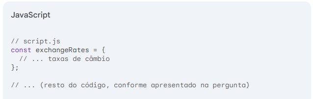
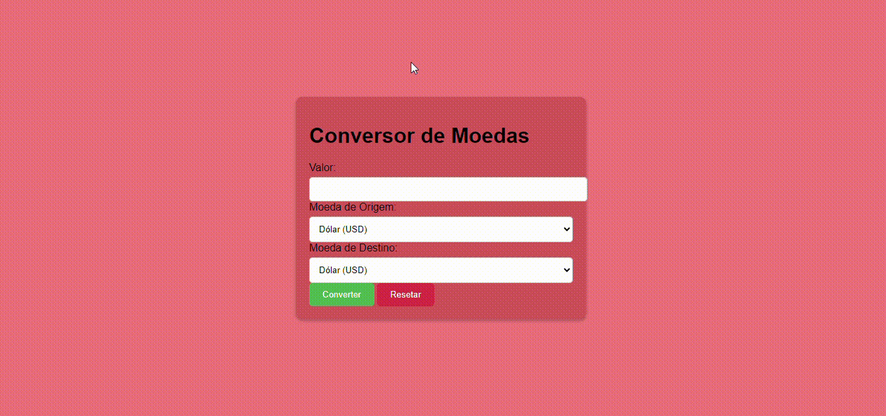

# CONVERSOR-DE-MOEDA

## Descrição
Este projeto tem como objetivo criar um aplicativo web simples que permite aos usuários converter valores monetários entre diferentes moedas. Utilizando JavaScript, HTML e CSS, o conversor oferece uma interface intuitiva para realizar cálculos de conversão com base em taxas de câmbio pré-definidas.

## Código Exemplo

## Funcionalidades
* Conversão de moedas: Permite converter valores entre diversas moedas, com base nas taxas de câmbio configuradas.
* Interface intuitiva: Possui um design simples e fácil de usar, com campos para inserir o valor e selecionar as moedas.
* Atualização automática: (Opcional) Pode ser implementado um mecanismo para atualizar as taxas de câmbio periodicamente, utilizando APIs externas.
## Tecnologias Utilizadas
* HTML: Estrutura da página e elementos do formulário.
* CSS: Estilização da página, deixando-a visualmente atraente.
* JavaScript: Lógica para realizar os cálculos de conversão e interagir com o usuário.
## Pré-requisitos
*Um navegador web moderno (Chrome, Firefox, Edge, etc.).
Conhecimento básico de HTML, CSS e JavaScript.
### Como Usar
* Insira o valor: Digite o valor que deseja converter no campo correspondente.
* Selecione as moedas: Escolha a moeda de origem e a moeda de destino nos menus dropdowns.
* Clique em "Converter": O resultado da conversão será exibido na área destinada para este fim.
* Para redefinir: Clique no botão "Reset" para limpar os campos e realizar uma nova conversão.
### Estrutura do Código
* index.html: Arquivo principal que contém a estrutura HTML da página, incluindo o formulário e os elementos para exibir o resultado.
* style.css: Arquivo CSS que contém as regras de estilo para a página.
* script.js: Arquivo JavaScript que contém a lógica da aplicação, incluindo a função de conversão e a interação com o DOM.
* exchangeRates.json: Arquivo JSON que armazena as taxas de câmbio de forma organizada.

## Resultado

## Autores 📍
[Liara Silva](https://github.com/LiaraSilva?tab=repositories)